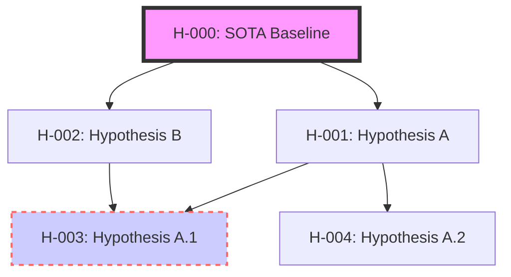
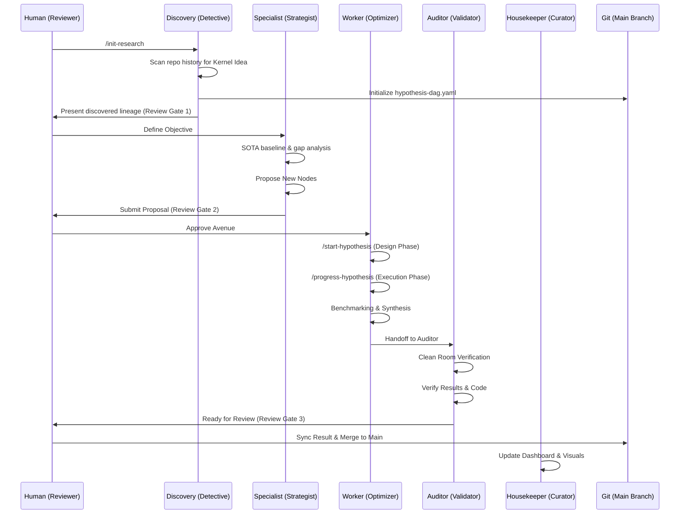

# Research Management System (RMS)

A standalone, performance-driven agentic system for tracking the **lineage of ideas** and conducting academic research.

---

## System Overview

The Research Management System (RMS) enables multiple AI agents to collaboratively navigate a "Hypothesis Space" and conduct rigorous scientific research. It is built on three core pillars:
1.  **Metric-Driven Lineage**: Tracking the evolution of ideas through actual performance gains against State-of-the-Art (SOTA) baselines.
2.  **Git-Centric Persistence**: Leveraging the natural versioning and branching of Git to maintain research strands.
3.  **Multi-Agent Ecosystem**: Specialized roles (Discovery, Specialist, Worker, Auditor) working together under Human-in-the-Loop (HITL) supervision.

---

## Visual Architecture

### 1. The Hypothesis Lineage Graph
The DAG tracks the branching and merging of research avenues.

### 2. Multi-Agent Workflow
How agents interact with the DAG and the repository.

---

## Key Components

| Component | Description |
| :--- | :--- |
| **`hypothesis-dag.yaml`** | The central map of the research solution space (root or `docs/`). |
| **`change/work-items/WI-NNN-research-*/`** | Dedicated AAW work item for each research node. |
| **`metadata.yaml`** | Per-node state tracking, stored within the research work item. |
| **`tools/`** | Agent-executable tools for discovery, branching, and auditing. |
| **`templates/`** | Markdown templates for Blog, ARXIV, and Pivot reports. |

---

## Documentation Index

- [**User Guide**](user-guide.md): Step-by-Step Instructions.
- [**Research Principles**](PRINCIPLES.md): Core guardrails and model leeway clauses.
- [**Agent Definitions**](../agents/): Detailed protocols for each specialized role.
- [**Framework Design**](../change/work-items/WI-001-research-management-system/deliverables/D01-framework-design.md): Detailed schema documentation.
