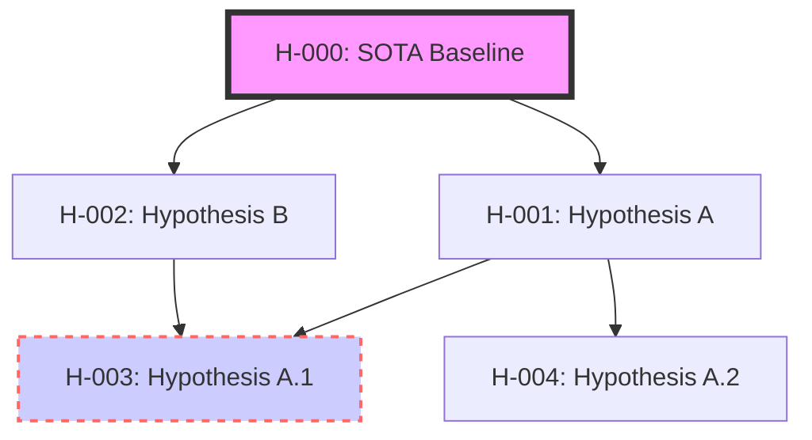
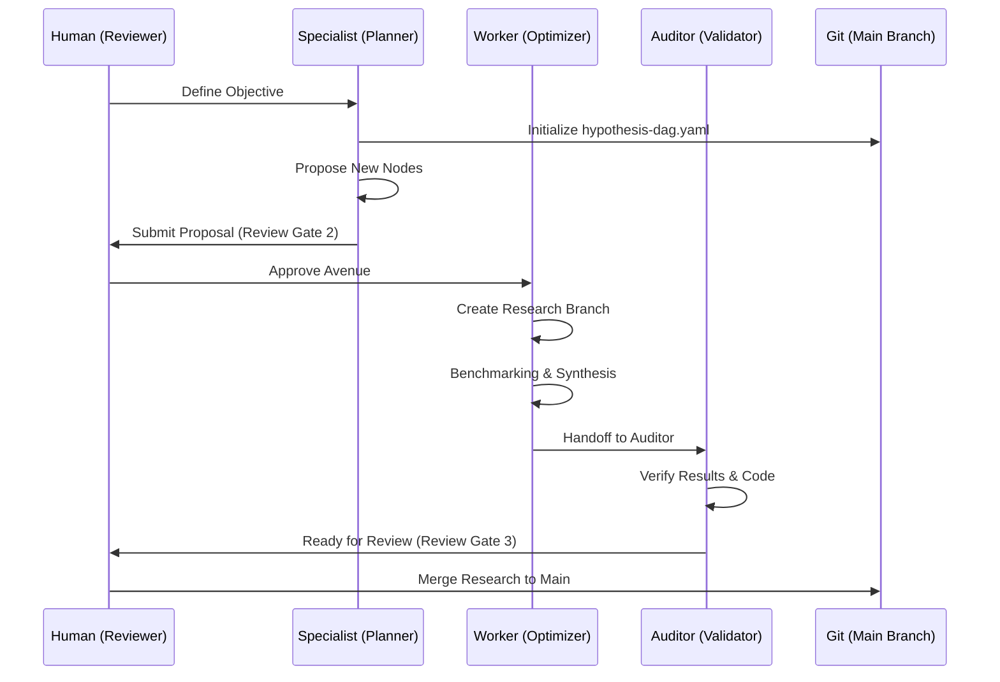

# Research Management System (RMS)

A standalone, performance-driven agentic system for tracking the **lineage of ideas** and conducting academic research.

---

## System Overview

The Research Management System (RMS) enables multiple AI agents to collaboratively navigate a "Hypothesis Space" and conduct rigorous scientific research. It is built on three core pillars:
1.  **Metric-Driven Lineage**: Tracking the evolution of ideas through actual performance gains against State-of-the-Art (SOTA) baselines.
2.  **Git-Centric Persistence**: Leveraging the natural versioning and branching of Git to maintain research strands.
3.  **Multi-Agent Ecosystem**: Specialized roles (Specialist, Worker, Auditor) working together under Human-in-the-Loop (HITL) supervision.

---

## Visual Architecture

### 1. The Hypothesis DAG (Directed Acyclic Graph)
The DAG tracks the branching and merging of research avenues.

### 2. Multi-Agent Workflow
How agents interact with the DAG and the repository.

---

## Key Components

| Component | Description |
| :--- | :--- |
| **`research.yaml`** (workspace root) | Signpost for O(1) agent discovery — points to initiative, root work item, DAG, and work items directory. |
| **Initiative** (intent repo `change/initiatives/`) | AAW Initiative grouping all research work items under a strategic goal. |
| **Root Work Item** (intent repo `change/work-items/`) | Holds foundational artifacts: hypothesis-dag.yaml, RESEARCH_PLAN.md, SOTA documents. |
| **Per-node Work Items** (intent repo `change/work-items/`) | Individual AAW work items for each research strand, with deliverables (blog, arxiv, benchmarks). |
| **`tools/`** | Agent-executable tools for discovery, branching, auditing, and DAG visualization (`dag_visual.py` generates SVG + PNG). |
| **`templates/`** | Markdown templates for Blog, ARXIV output, and research.yaml signpost. |

---

## Documentation Index

- [**User Guide**](user-guide.md): Step-by-step instructions for humans and agents.
- [**Framework Design**](../change/work-items/WI-001-research-management-system/deliverables/D01-framework-design.md): Detailed schema and convention documentation.
- [**API Integration**](../change/work-items/WI-001-research-management-system/deliverables/D02-api-integration.md): Details on academic source integrations.
