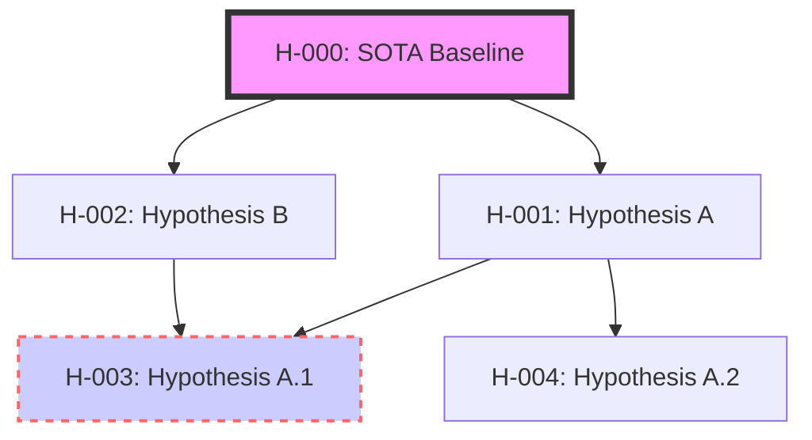
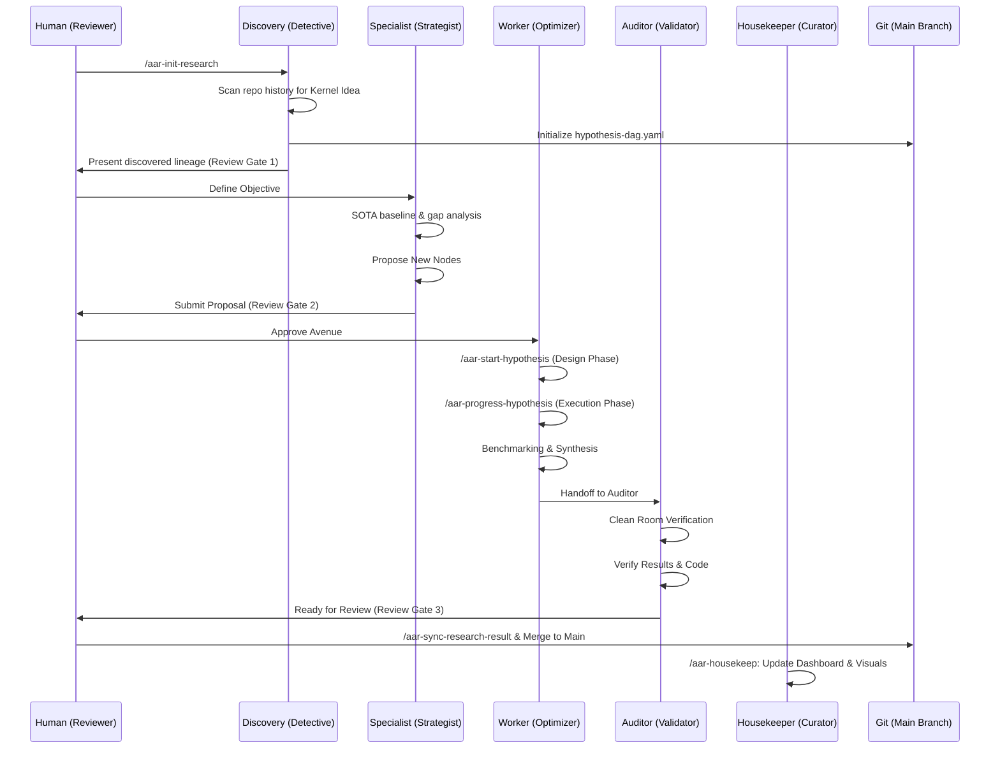

# AI-Assisted Research documentation

AI-Assisted Research (AAR), also called the Research Management System (RMS), tracks the
lineage of ideas: a hypothesis DAG where every node is a measurable claim, tested against a
target fixed before the result is known, with AI agents doing the work through Agent
Skills.

## Start here

| Page | For |
|---|---|
| [Quick start](quick-start.md) | From an empty folder to a working DAG, index, dashboard and literature search in ten minutes |
| [Concepts](concepts.md) | The ideas you need, in the order you need them |
| [User guide](user-guide.md) | The full research cycle, step by step |
| [Skills](skills.md) | What each of the twelve skills does, when to use it, what it needs |

## Reference

| Page | Covers |
|---|---|
| [Commands](commands.md) | Every script, subcommand and flag, and the skill invocations |
| [Configuration](configuration.md) | `research.yaml`, environment variables, precedence, file formats, manifests |
| [Troubleshooting](troubleshooting.md) | The tools' error and warning messages, and what to do about each |
| [The shared DAG store](../skills/research-dag/references/dag-store.md) | One DAG changed by several machines and agents at once |
| [Reconcile finding kinds](../skills/aar-reconcile/references/finding-kinds.md) | What each `reconcile.py` finding means |
| [Node selection](../skills/aar-start-hypothesis/references/node-selection.md) | How the skills choose work from the node index |

## Design

| Page | Covers |
|---|---|
| [Research principles](PRINCIPLES.md) | The guardrails every skill follows, and the model leeway clause |
| [Agent roles](AGENTS.md) | Discovery, Specialist, Worker, Auditor, Reconciler, Housekeeper |
| [Adoption and drift](adoption-and-drift.md) | The second axis: whether a validated finding is live, and how drift is detected |
| [AAW inquiry seam](aaw-inquiry-seam.md) | How an AAW inquiry becomes a hypothesis, and how a conclusion returns to delivery |
| [Framework design](../change/work-items/WI-001-research-management-system/deliverables/D01-framework-design.md) | The original design work item and its schema |
| [The research fog and AI lineage](articles/the-research-fog-and-ai-lineage.md) | Why a lineage of ideas matters, as an article |

## Examples in the repository

| Example | Shows |
|---|---|
| [`research.yaml.example`](../skills/research-dag/assets/research.yaml.example) | A complete, commented workspace configuration |
| [Quick start, step 4](quick-start.md#4-write-a-tiny-dag) | The smallest useful DAG |
| [`tests/test_dag_store.py`](../tests/test_dag_store.py) | A hierarchical DAG with comments, block ids and adoption blocks (`FIXTURE`), and the store's behaviour under concurrent writers |
| [CI, job "Python tools"](../.github/workflows/ci.yml) | Two end-to-end runs of the tools in a scratch workspace: plain file, and against a DAG store in a local bare repository |
| [Output templates](../skills/aar-progress-hypothesis/assets/templates/) | Blog post, arXiv draft, pivot report and changes log |
| [WI-001](../change/work-items/WI-001-research-management-system/) | A complete AAW work item: scope, plan, progress and deliverables |

## How the parts fit

### The hypothesis lineage graph

The DAG tracks the branching and merging of research avenues.

```mermaid
graph TD
    H00[H-000: SOTA Baseline] --> H01[H-001: Hypothesis A]
    H00 --> H02[H-002: Hypothesis B]
    H01 --> H03[H-003: Hypothesis A.1]
    H02 --> H03
    H01 --> H04[H-004: Hypothesis A.2]
    
    style H00 fill:#f9f,stroke:#333,stroke-width:4px
    style H03 fill:#ccf,stroke:#f66,stroke-width:2px,stroke-dasharray: 5 5
```

### The multi-agent workflow

How the roles, and the skills that carry them, interact with the DAG and the repository.

```mermaid
sequenceDiagram
    participant H as Human (Reviewer)
    participant D as Discovery (Detective)
    participant S as Specialist (Strategist)
    participant W as Worker (Optimizer)
    participant A as Auditor (Validator)
    participant K as Housekeeper (Curator)
    participant G as Git (Main Branch)

    H->>D: /aar-init-research
    D->>D: Scan repo history for Kernel Idea
    D->>G: Initialize hypothesis-dag.yaml
    D->>H: Present discovered lineage (Review Gate 1)
    H->>S: Define Objective
    S->>S: SOTA baseline & gap analysis
    S->>S: Propose New Nodes
    S->>H: Submit Proposal (Review Gate 2)
    H->>W: Approve Avenue
    W->>W: /aar-start-hypothesis (Design Phase)
    W->>W: /aar-progress-hypothesis (Execution Phase)
    W->>W: Benchmarking & Synthesis
    W->>A: Handoff to Auditor
    A->>A: Clean Room Verification
    A->>A: Verify Results & Code
    A->>H: Ready for Review (Review Gate 3)
    H->>G: /aar-sync-research-result & Merge to Main
    K->>K: /aar-housekeep: Update Dashboard & Visuals
```

### Key components

| Component | Description |
|---|---|
| `research.yaml` | The workspace configuration at the repository root: where the DAG, index, work items and dashboard live |
| `research/hypothesis-dag.yaml` | The map of the research solution space |
| `research/node-index.yaml` | Which nodes are ready, active, framed or blocked, computed from the DAG |
| AAW work items (`work_items_path`) | One per research node, created through AI-Assisted Work |
| `metadata.yaml` | Per-node state in the work item: fixed parent performance and target, measured result, handoffs |
| `skills/research-dag/` | The hypothesis DAG engine the research skills share: DAG updates, node index, dashboard, reference validation, branches, and the optional shared DAG store |
| `skills/literature-discovery/` | Literature search: OpenAlex discovery, Semantic Scholar ranking, and a state-of-the-art baseline. Usable on its own |
| `skills/aar-*/` | The ten research workflows, each a self-contained `SKILL.md` with its own scripts, references and templates |
